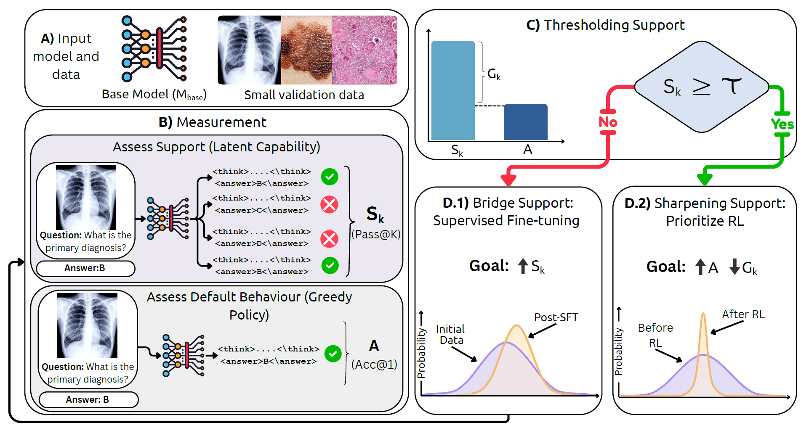

# MedBridgeRL: When Does RL Help Medical VLMs? Disentangling Vision, SFT, and RL Gains

<a target="_blank" href="https://arxiv.org/abs/2603.01301">
  
</a>
<a target="_blank" href="https://medbridgerl.github.io/">
  
</a>
<a target="_blank" href="">
  
</a>

**Authors:**  
[Ahmadreza Jeddi*](https://armenjeddi.github.io/), [Kimia Shaban*](https://kimiashaban.github.io/), Negin Baghbanzadeh*, Natasha Sharan, Abhishek Moturu, [Babak Taati](https://www.cs.toronto.edu/~taati/)
<br>



---

This repository contains the official implementation of **MedBridgeRL**.


## MedBridgeRL-Eval • Pass@K “Reasoning Boundary” Evaluation (Qwen2.5-VL)

This repository is a minimal, reproducible evaluation kit to measure a medical VLM’s *reasoning boundary* using Pass@K:
- Export MedBridgeRL-Eval → local JSONL + images/
- Run K-sample inference using Qwen2.5-VL (base or RL)
- Robustly parse <answer>…</answer> even when generations drift
- Report:
  - pass@K
  - format failure rate (no parseable <answer> across K samples)
  - avg unique answers@K (diversity)
  - per-dataset breakdown

Designed for Qwen2.5-VL, but the JSONL format is generic and easy to adapt.

---

## Repo layout

- export_medbridgerl_eval_to_jsonl.py  
  Downloads our dataset from Hugging Face and exports:
  - data.jsonl
  - images/

- inference.py  
  Pass@K evaluation on data.jsonl. Prints overall + per-dataset metrics.

- linprobe.py (optional)  
  Linear probe baseline on an ImageFolder-style dataset using Qwen2.5-VL vision features.

- knn.py (optional)  
  kNN baseline on an ImageFolder-style dataset using Qwen2.5-VL vision features.

- requirements.txt  
  Pinned deps for reproducibility.

---

## Installation

Python 3.11 recommended.

    python -m venv .venv
    source .venv/bin/activate
    pip install -U pip
    pip install -r requirements.txt

(Optional) FlashAttention for speed (CUDA builds only):

    pip install flash-attn --no-deps

If FlashAttention fails to install, run inference with eager attention:

    python inference.py ... --attn_impl eager

---

## 1) Export MedVLThinker-Eval → JSONL + images

This script downloads the dataset from Hugging Face and writes a local folder with:
- data.jsonl
- images/

Full export (recommended):

    python export_medvlthinker_eval_to_jsonl.py \
      --out_dir ./vlaa \
      --split test

Outputs:

    ./vlaa/data.jsonl
    ./vlaa/images/

Smoke test export (fast):

    python export_medvlthinker_eval_to_jsonl.py \
      --out_dir ./vlaa_smoke \
      --split test \
      --max_examples 20

Export a different split:

    python export_medvlthinker_eval_to_jsonl.py \
      --out_dir ./vlaa_train \
      --split train

---

## JSONL format (what inference.py expects)

Each JSON line is one example with key fields:
- dataset_name (str)
- dataset_index (int)
- image_paths (list[str])  ← paths must exist on disk
- question (str)
- options_dict (dict | null)
- options (list | null)
- answer_label (str | null)
- answer (str | null)

The exporter writes image_paths pointing into --out_dir/images/.

---

## 2) Run Pass@K inference (inference.py)

inference.py loads a model, samples K generations per question, parses <answer>…</answer>, and computes metrics.

Standard run (uses defaults):

    python inference.py \
      --model Qwen/Qwen2.5-VL-7B-Instruct \
      --data_jsonl ./vlaa/data.jsonl

Save results to a log file (recommended):

    python inference.py \
      --model Qwen/Qwen2.5-VL-7B-Instruct \
      --data_jsonl ./vlaa/data.jsonl \
      | tee results_qwen2p5vl7b_k16.txt

Smoke test inference (fast):

    python inference.py \
      --model Qwen/Qwen2.5-VL-7B-Instruct \
      --data_jsonl ./vlaa_smoke/data.jsonl \
      --k 4 \
      --max_examples 20 \
      --max_new_tokens 512

Reproducible sampling (fixed seed):

    python inference.py \
      --model Qwen/Qwen2.5-VL-7B-Instruct \
      --data_jsonl ./vlaa/data.jsonl \
      --seed 123 \
      --k 16 \
      --temperature 0.7 \
      --top_p 0.9

More exploration / higher diversity@K:

    python inference.py \
      --model Qwen/Qwen2.5-VL-7B-Instruct \
      --data_jsonl ./vlaa/data.jsonl \
      --k 32 \
      --temperature 1.0 \
      --top_p 0.95 \
      --max_new_tokens 1024

If FlashAttention isn’t available:

    python inference.py \
      --model Qwen/Qwen2.5-VL-7B-Instruct \
      --data_jsonl ./vlaa/data.jsonl \
      --attn_impl eager

## 3) Optional baselines: linprobe + kNN (ImageFolder-style data)

### Linear probe (linprobe.py)

Default run:

    torchrun --nproc_per_node=1 linprobe.py \
      --data_root /path/to/data_root \
      --base_vlm_id Qwen/Qwen2.5-VL-7B-Instruct

Small sanity run:

    torchrun --nproc_per_node=1 linprobe.py \
      --data_root /path/to/data_root \
      --base_vlm_id Qwen/Qwen2.5-VL-7B-Instruct \
      --epochs 2 \
      --batch_size 64 \
      --log_every 10

Change hyperparams + save checkpoints:

    torchrun --nproc_per_node=1 linprobe.py \
      --data_root /path/to/data_root \
      --base_vlm_id Qwen/Qwen2.5-VL-7B-Instruct \
      --epochs 20 \
      --batch_size 256 \
      --lr 0.05 \
      --pooling mean \
      --save ./linprobe_ckpts \
      --workers 8

Multi-GPU on one node (DDP):

    torchrun --nproc_per_node=4 linprobe.py \
      --data_root /path/to/data_root \
      --base_vlm_id Qwen/Qwen2.5-VL-7B-Instruct \
      --epochs 20 \
      --batch_size 256 \
      --workers 8

### kNN baseline (knn.py)

Default run:

    python knn.py \
      --data_root /path/to/data_root \
      --base_vlm_id Qwen/Qwen2.5-VL-7B-Instruct

Faster sanity run (limit train/val):

    python knn.py \
      --data_root /path/to/data_root \
      --base_vlm_id Qwen/Qwen2.5-VL-7B-Instruct \
      --limit_train 2000 \
      --limit_val 500 \
      --batch_size 64 \
      --workers 8

Larger k + different pooling:

    python knn.py \
      --data_root /path/to/data_root \
      --base_vlm_id Qwen/Qwen2.5-VL-7B-Instruct \
      --k 50 \
      --pooling mean \
      --batch_size 64

CPU fallback:

    python knn.py \
      --data_root /path/to/data_root \
      --base_vlm_id Qwen/Qwen2.5-VL-7B-Instruct \
      --device cpu

Chunking (reduces feature memory):

    python knn.py \
      --data_root /path/to/data_root \
      --base_vlm_id Qwen/Qwen2.5-VL-7B-Instruct \
      --chunk 64

---

## Troubleshooting

“Image not found” during inference:
Make sure you exported first, didn’t move images/, and are pointing to the correct JSONL.

Quick check:

    python -c "import json; print(json.loads(open('./vlaa/data.jsonl').readline())['image_paths'][:2])"
    ls -lah ./vlaa/images | head

FlashAttention issues:
Run:

    python inference.py ... --attn_impl eager

## Citation
If you find this work useful, please give us a citation:
```bibtex
@misc{jeddi2026doesrlhelpmedical,
      title={When Does RL Help Medical VLMs? Disentangling Vision, SFT, and RL Gains}, 
      author={Ahmadreza Jeddi and Kimia Shaban and Negin Baghbanzadeh and Natasha Sharan and Abhishek Moturu and Elham Dolatabadi and Babak Taati},
      year={2026},
      eprint={2603.01301},
      archivePrefix={arXiv},
      primaryClass={cs.CV},
      url={https://arxiv.org/abs/2603.01301}, 
}
```

